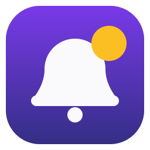

# weebo-bridge-notify

<p align="center">
  
</p>

Pont de notifications entre le pod d'un workspace [Eclipse Che](https://eclipse.dev/che/) et l'utilisateur, décliné en **deux extensions** :

- une extension **code-oss / VS Code** (racine du repo) ;
- un plugin **JetBrains** (IntelliJ IDEA, PyCharm, WebStorm... — dossier [`jetbrains/`](jetbrains/), [readme dédié](jetbrains/README.md)).

N'importe quel process du pod (script, CI locale, hook d'une IA — Claude Code, Codex, Gemini CLI...) écrit une ligne dans `~/.ide-notify`, et l'extension :

1. affiche une popup native dans l'IDE (en bas à droite) ;
2. côté VS Code uniquement, relaie optionnellement vers une **notification OS** via l'API Notification du navigateur (pont OS).

Basé sur le template [weebo-base](https://github.com/batleforc/weebo-base).

## Usage

```bash
# Format brut : niveau|message (niveaux : info, warn, error)
echo "info|Build terminé ✅" >> ~/.ide-notify

# Ou via le CLI — installé automatiquement dans ~/.local/bin (PATH) à l'activation de l'extension
ide-notify warn "Attention, il se passe un truc"

# Depuis un hook Claude Code (payload JSON sur stdin)
echo '{"hook_event_name":"Notification","message":"Claude a besoin de toi"}' | ide-notify

# Avec des call to action (boutons dans la popup IDE)
ide-notify info "Build terminé ✅" --action-url "Voir la CI=https://..." --action-shell "Relancer=task build"
```

- `info` et `warn` s'effacent seuls, `error` reste affichée jusqu'à fermeture.
- Variables d'env : `IDE_NOTIFY_FILE` (fichier cible), `IDE_NOTIFY_LEVEL` (niveau par défaut en mode stdin).

## Brancher une IA (Claude Code, Codex, Gemini CLI...)

Le binaire `bin/ide-notify` accepte le JSON des agents **sur stdin** (hooks Claude Code) ou **en argument** (notify Codex CLI), déduit le niveau (`warn` pour les demandes de permission) et préfixe le message avec la source. Exemple pour Claude Code (`~/.claude/settings.json`) :

```json
{
  "hooks": {
    "Notification": [
      {
        "hooks": [
          { "type": "command", "command": "ide-notify 2>/dev/null || true" }
        ]
      }
    ]
  }
}
```

Toutes les intégrations (Claude Code, Codex CLI, outils sans hook dédié, scripts, Taskfile) sont détaillées avec exemples dans **[docs/integrations.md](docs/integrations.md)**.

## Côté admin plateforme : notifier les devs dans leur IDE

Le canal n'est qu'un fichier dans le pod : un **admin de la plateforme** (cluster Kubernetes / Eclipse Che) peut donc pousser une notification directement dans l'IDE des devs, sans mail ni canal de chat que personne ne lit en codant — là où le dev a les yeux, au moment où ça le concerne :

- **maintenance planifiée** : « la plateforme redémarre à 18h, sauvegardez votre travail » ;
- **incident en cours** : registre indisponible, CI dégradée, avec un bouton vers la page de statut ;
- **cycle de vie du workspace** : arrêt imminent pour inactivité, quota de stockage bientôt atteint ;
- **sécurité / conformité** : rotation de secrets à faire, image de base dépréciée à mettre à jour.

Un `kubectl exec` suffit, workspace par workspace ou en masse via le label des pods DevWorkspace :

```bash
# Prévenir tous les workspaces démarrés d'une maintenance
kubectl get pods -A -l controller.devfile.io/devworkspace_name \
  --no-headers -o custom-columns=NS:.metadata.namespace,POD:.metadata.name |
while read ns pod; do
  kubectl exec -n "$ns" "$pod" -- sh -c \
    'echo "warn|⚠️ Maintenance plateforme à 18h00 — sauvegardez et poussez votre travail" >> ~/.ide-notify'
done
```

Les lignes JSON avec `actions` fonctionnent aussi (bouton « Voir le statut » vers la page d'incident, `shell` pour lancer une commande de remédiation...), et le message atteint le dev quel que soit son IDE — code-oss/VS Code ou JetBrains — puisque les deux extensions écoutent le même fichier. Si le pod a plusieurs conteneurs, cibler avec `-c` celui dont le HOME porte le `~/.ide-notify` surveillé (celui de l'IDE).

## Pont notifications OS (navigateur)

Les webviews de che-code sont servies depuis la même origine que l'IDE : une webview peut donc utiliser l'API `Notification` de Chrome avec la permission du site.

Le pont vit dans une vue du **panneau du bas** (onglet « Bridge Notify », à côté du terminal) — pas d'onglet d'éditeur.

1. `F1` → `Weebo Bridge Notify: Ouvrir le pont notifications OS (navigateur)` (ou cliquer l'onglet « Bridge Notify » du panneau).
2. Cliquer sur « Activer les notifications navigateur » et accepter la permission Chrome.
3. La vue peut ensuite être masquée et le panneau fermé : le relais continue en arrière-plan (`retainContextWhenHidden`).

Avec le setting `weeboBridgeNotify.osBridge.autoOpen`, la vue s'ouvre à chaque démarrage pour armer le pont. En ajoutant `weeboBridgeNotify.osBridge.autoClose`, le panneau se referme ensuite tout seul : rien de visible, le pont tourne quand même.

## Plugin JetBrains

Le dossier [`jetbrains/`](jetbrains/) contient le plugin équivalent pour les IDE JetBrains (IntelliJ IDEA, PyCharm, WebStorm, GoLand...), en Kotlin avec l'[IntelliJ Platform Gradle Plugin](https://plugins.jetbrains.com/docs/intellij/tools-intellij-platform-gradle-plugin.html) — voir aussi son [readme dédié](jetbrains/README.md). Il partage le même canal `~/.ide-notify` et embarque le même CLI `bin/ide-notify` (copié au build) :

- chaque ligne devient une notification native (balloon) — `info`/`warn` s'effacent seules, `error` reste affichée ;
- les call to action deviennent des boutons de la notification : `url`, `file` (+ `line`), `shell` (terminal intégré), `copy`, et `command` qui exécute une **action IDE par id** (équivalent JetBrains des commandes VS Code, ex. `CheckForUpdate`) ;
- le CLI `ide-notify` est installé dans `~/.local/bin` au démarrage (désactivable) ;
- réglages dans `Settings → Tools → Weebo Bridge Notify` (fichier, intervalle, installation du CLI) ;
- notification de test via `Tools → Weebo Bridge Notify: Envoyer une notification de test`.

Le pont OS navigateur n'existe pas côté JetBrains : hors navigateur, l'IDE (ou le client JetBrains Gateway) affiche déjà ses notifications sur la machine de l'utilisateur.

Compatibilité : IDE JetBrains **2026.1 et plus** (`since-build 261`) ; l'action `shell` utilise la nouvelle API terminal (module `intellij.terminal.frontend`).

Build : JDK 21 requis (ex. `mise use java@temurin-21`), puis `task jetbrains:build` produit `dist/weebo-bridge-notify-<version>.zip`, à installer via `Settings → Plugins → ⚙️ → Install Plugin from Disk`.

## Tasks

```bash
task vsix:build        # Package l'extension en dist/weebo-bridge-notify.vsix
task vsix:install      # Build + installe dans code-oss (recharger la fenêtre ensuite)
task vsix:test         # Envoie une notification de test
task vsix:publish      # Publie sur le registre Open VSX perso (OVSX_REGISTRY_URL, OVSX_PAT)
task jetbrains:build   # Package le plugin JetBrains en .zip dans dist/ (JDK 21 requis)
task jetbrains:verify  # Plugin Verifier (compatibilité API JetBrains)
task jetbrains:test    # Envoie une notification de test (même canal)
task jetbrains:clean   # Supprime les dossiers de build Gradle
task lint              # Vérifie la syntaxe des sources
task audit             # Audit sécurité (dépendances + secrets)
```

## CI/CD

Au push d'un tag `v*` (posé par `cog bump`), le workflow [`release.yaml`](.github/workflows/release.yaml) builde les deux extensions (outillage installé via `mise.toml`, builds via les tasks du repo) et publie une **pre-release GitHub** avec les deux artefacts, versionnés sur le tag :

- `weebo-bridge-notify-<version>.vsix` (code-oss / VS Code) ;
- `weebo-bridge-notify-<version>.zip` (JetBrains).

La release reste en pre-release : la passer en release stable est une action manuelle sur GitHub.

## Settings

| Setting | Défaut | Description |
|---|---|---|
| `weeboBridgeNotify.file` | `~/.ide-notify` | Fichier surveillé |
| `weeboBridgeNotify.installCli` | `true` | Installe le CLI `ide-notify` dans `~/.local/bin` à l'activation |
| `weeboBridgeNotify.pollInterval` | `1000` | Intervalle de surveillance (ms) |
| `weeboBridgeNotify.osBridge.autoOpen` | `false` | Ouvre le pont OS au démarrage |
| `weeboBridgeNotify.osBridge.autoClose` | `false` | Referme le panneau une fois le pont armé au démarrage |

Côté JetBrains, les trois premiers réglages existent aussi, dans `Settings → Tools → Weebo Bridge Notify` (les réglages `osBridge.*` n'ont pas d'équivalent).
